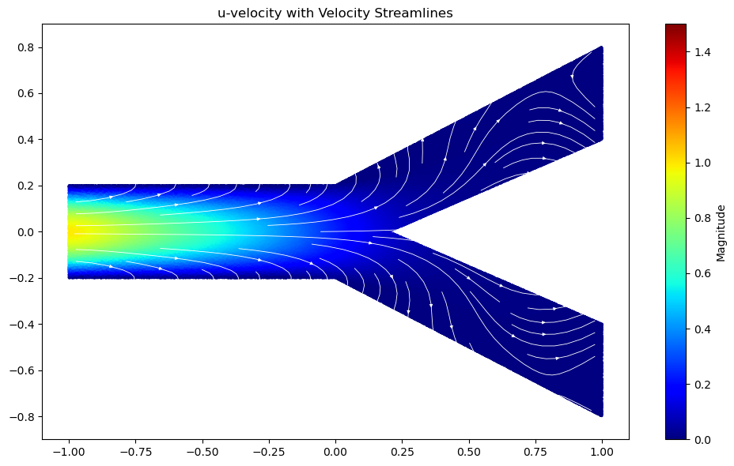
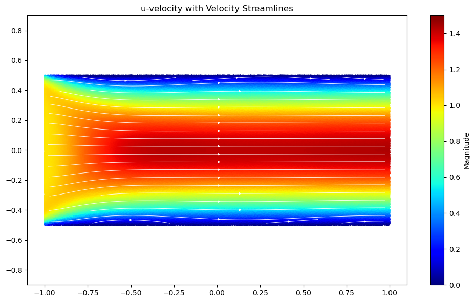
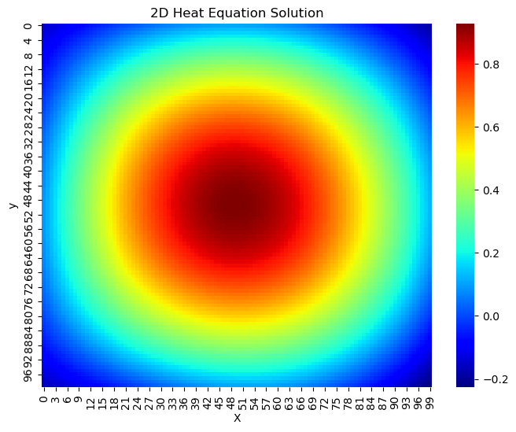
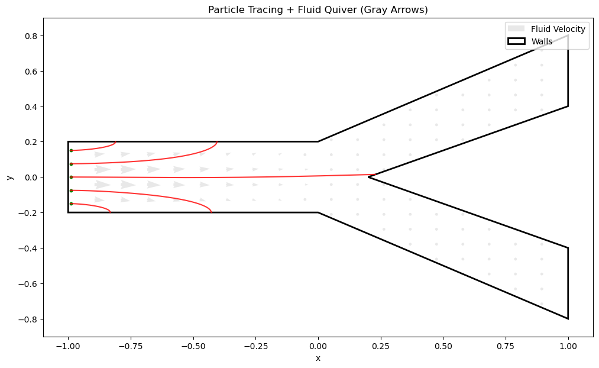

# Physics-Informed Neural Networks (PINNs)

Forward **Physics-Informed Neural Network** projects for classic PDEs — Burgers', heat/diffusion, and incompressible Navier–Stokes flow (including particle tracing). Implemented in **PyTorch** (from scratch) and **[DeepXDE](https://deepxde.readthedocs.io/)**.

<p align="center">
  <br>
  <em>PINN solution of Navier–Stokes flow through a Y-shaped channel (velocity magnitude + streamlines).</em>
</p>

---

## How a PINN works

A neural network $u_\theta(x,t)$ is trained so that it satisfies the PDE *and* its initial/boundary conditions. The PDE is turned into a residual using automatic differentiation, and the network is optimized to drive that residual to zero:

$$\mathcal{L}(\theta) = \mathcal{L}_{\text{PDE}} + \mathcal{L}_{\text{BC}} + \mathcal{L}_{\text{IC}} + \mathcal{L}_{\text{data}}$$

For example, the Burgers' residual minimized at a set of collocation points is

$$r_\theta(x,t) = \frac{\partial u_\theta}{\partial t} + u_\theta\frac{\partial u_\theta}{\partial x} - \nu\frac{\partial^2 u_\theta}{\partial x^2}.$$

## Governing equations

**Burgers' equation (1D/2D)**

$$u_t + u\,u_x = \nu\,u_{xx}$$

**Heat / diffusion equation**

$$u_t = \alpha\,u_{xx} \qquad\text{(1D)}\qquad\qquad u_t = \alpha\,(u_{xx} + u_{yy}) \qquad\text{(2D)}$$

**Incompressible Navier–Stokes (2D)**

$$\nabla\cdot\mathbf{u} = 0, \qquad \mathbf{u}_t + (\mathbf{u}\cdot\nabla)\,\mathbf{u} = -\frac{1}{\rho}\nabla p + \nu\,\nabla^2\mathbf{u}$$

## Projects

| Notebook | Problem | Framework |
|---|---|---|
| [`Burgers_1D_main.ipynb`](Burgers_1D_main.ipynb) | 1D viscous Burgers' equation | PyTorch |
| [`burgers_2D_main.ipynb`](burgers_2D_main.ipynb) | 2D Burgers' equation | NumPy / Matplotlib |
| [`heat_main.ipynb`](heat_main.ipynb) | 1D heat (diffusion) equation | NumPy / PyTorch |
| [`deepxde_1d_heat_main-2.ipynb`](deepxde_1d_heat_main-2.ipynb) | 1D heat equation | DeepXDE |
| [`Heat_2D_pinns_main.ipynb`](Heat_2D_pinns_main.ipynb) | 2D heat equation | PyTorch |
| [`ns_deepxde_main.ipynb`](ns_deepxde_main.ipynb) | 2D Navier–Stokes flow | DeepXDE |
| [`NS_Particle_Tracing_DeepXDE_main.ipynb`](NS_Particle_Tracing_DeepXDE_main.ipynb) | Navier–Stokes + particle tracing | DeepXDE |
| [`NS_Particle_Tracing_DeepXDE_Y_Shape_main.ipynb`](NS_Particle_Tracing_DeepXDE_Y_Shape_main.ipynb) | NS + particle tracing, Y-shaped channel | DeepXDE |
| [`NS_Particle_Tracing_DeepXDE_Y_Shape_main_ver2.ipynb`](NS_Particle_Tracing_DeepXDE_Y_Shape_main_ver2.ipynb) | NS + particle tracing, Y-shaped channel (v2) | DeepXDE |
| [`NS_particle.ipynb`](NS_particle.ipynb) | Particle-tracing helper / snippet | DeepXDE |
| [`Erfan_PyTorch4.ipynb`](Erfan_PyTorch4.ipynb) | PyTorch & autograd warm-up | PyTorch |

## Results

| | |
|:---:|:---:|
| <br><em>Navier–Stokes: u-velocity with streamlines</em> | <br><em>2D heat equation solution</em> |
| <br><em>Y-channel velocity field + streamlines</em> | <br><em>Particle tracing through the Y-channel</em> |

> `*.dat` files (`loss.dat`, `train.dat`, `test.dat`) are training/evaluation logs produced by the DeepXDE notebooks.

## Tech stack

Python 3.9+ · [PyTorch](https://pytorch.org/) · [DeepXDE](https://deepxde.readthedocs.io/) · NumPy · SciPy · Matplotlib

## Getting started

```bash
git clone https://github.com/erfant00001/physics-informed-neural-networks.git
cd physics-informed-neural-networks
pip install torch deepxde numpy scipy matplotlib jupyter
jupyter notebook
```

Open any notebook and run the cells top to bottom.

## Acknowledgements

These projects were created while learning Physics-Informed Neural Networks and Scientific Machine Learning from the Udemy courses of **Dr. Mohammad Samara** (Data Science / Machine Learning expert; PhD, University of Tokyo).

Instructor profile: **https://www.udemy.com/user/mohammad-samara-18/**

The problem setups and course material are credited to the instructor. This repository contains my own implementations and notes produced while following the courses, shared for learning and reference.
